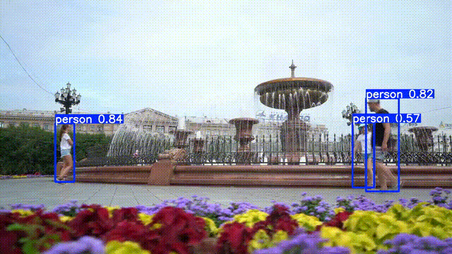

#  YOLOv5 Object Detection on Video

This project demonstrates object detection using the YOLOv5 model on images and videos.  
It includes an example of person detection on a sample video, with results saved as both `.mp4` and `.gif`.

---

## Tech Stack

- Python 3.8+
- OpenCV
- PyTorch
- YOLOv5 (object detection)
- ffmpeg (for GIF conversion)

---

## Features

- Runs YOLOv5 object detection on images and videos using a simple Python script
- Supports multiple input sources: single image, image folder, video file, or webcam (`--source 0`)
- Uses pretrained YOLOv5s weights (`yolov5s.pt`) for fast person/vehicle/general object detection
- Automatically saves annotated outputs (images/videos with bounding boxes and labels) under `runs/detect/`
- Includes an example detection result exported as a GIF (`results/people.gif`) for easy sharing
- Based on the official YOLOv5 repository, making it easy to extend to custom datasets or fine-tuned models

---

##  Project Structure

```text
YOLOv5_Object_Detection/
├── yolov5/                    # YOLOv5 source code (from official repo)
│   ├── detect.py              # Main detection script
│   ├── fixed_people.mp4       # Example input video
│   ├── yolov5s.pt             # Pretrained YOLOv5s weights
│   ├── results/               # Output results
│   │   └── people.gif         # GIF version of the detection video
│   ├── runs/                  # Auto-created outputs (detected images/videos)
│   ├── requirements.txt       # Required Python packages
│   └── ...
└── README.md
```
---

## Run Detection on Video
1. **Move into the YOLOv5 folder**
cd yolov5

2. **Install required Python packages (first time only)**
pip install -r requirements.txt

3. **Run YOLOv5 on the example video**
python3 detect.py \
  --weights yolov5s.pt \
  --source fixed_people.mp4 \
  --conf 0.4 \
  --img 640

---

## Result Preview


---

## Future Improvements

- Add webcam live detection with OpenCV
- Support for video stream input from IP camera
- Integrate with ROS2 node for real-time robot deployment
- Export detection results as JSON or CSV
- Add object tracking module (e.g., DeepSORT)

---

## License

This project is licensed under the MIT License.

---

## Author

- GitHub: [Gyuhyeok001](https://github.com/Gyuhyeok001)
